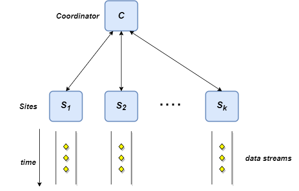

## Description

#### **Count-Tracking problem - Distributed Continuous Model**

    1. Workers
    2. Coordinator
    3. Two-way communication channel
    4. Continuous query
    5. Value Monitoring
    6. Cash-Register Model

There are k distributed sites, each receiving a stream of elements over time, possibly at varying rates. Each site holds a local counter $n_i$ , initially zero (increments only - Cash Register Model). 

Also, there is a central site or Coordinator whose job is to coordinate the whole process. In particular, Coordinator can communicate directly with each site, there is direct two-way communication with each of the sites. The sites do not communicate with each other directly but this is not a limitation since they can always send messages via the Coordinator. The goal is continuously at all times the Coordinator provides an estimate of the monitoring function such that the difference is always bounded(**value monitoring**) using the minimal communication cost. In this case, we focus on the Count-Tracking Problem, the Coordinator's job is to maintain an **(ε,δ)-approximation** of the total count continuously at all times with minimal communication cost.

> (1-ε)∙n(t) ≤ $n_a$ ≤ (1+ε)∙n(t) with prob.=1-δ,∀t

## EXACT counters

1. The Coordinator maintains the exact total count continuously at all times
   
2. Each site send a message to the Coordinator whenever the counter increments by 1
3. Communication cost: O(N), Ν: Final value of total count

## CONTINUOS counters

1. The Coordinator maintains an ε-approximation of the total count continuously at all times
   
2. Each site send a message to the Coordinator whenever the counter increments by 1+ε
   
3. One-way communication cost
4. Communication cost: O(k/ε ∙ logN), Ν: Final value of total count

## A Randomized Approach to the problem

#### **[RANDOMIZED COUNTERS(RC)](https://arxiv.org/abs/1108.3413)**

1. The Coordinator maintains an (ε,δ)-approximation of the total count continuously at all times

1. The basic idea is that each site sends a message to the Coordinator with probability p. To achieve the goal, it is sufficient to define the probability p=Θ(√k/εn)
   
2. Two-way communication cost

3. Working in rounds – logN rounds

4. Communication cost: O(√k/ε ∙ logN), Ν: Final value of total count

## A Deterministic approach to the problem 

#### **DETERMINISTIC COUNTERS(DC)**

1. The Coordinator maintains an ε-approximation of the total count continuously at all times

1. The basic idea is that the maximum error in the Coordinator to maintain an ε-approximation is equal εn. Accordingly, the maximum error that can be supported from each site is equal to εn/k, therefore each site sends a message to the Coordinator when the local counter is incremented by  Θ(εn/k).

2. Two-way communication cost

2. Working in rounds – logN rounds

3. Communication cost: O(k/ε ∙ logN), Ν: Final value of total count

## Space and Communication complexity

**Count-Tracking Problem** | **Space(per site)** | **Communication cost**
---------|----------|---------
 **EXACT** | O(1) | O(N)
 **RANDOMIZED** | O(1) | O(√k/ε ∙ logN)
 **DETERMINISTIC** | O(1) | O(k/ε ∙ logN)
 **CONTINUOUS** | O(1) | O(κ/ε ∙ logN)
